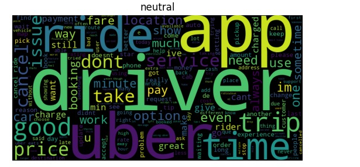
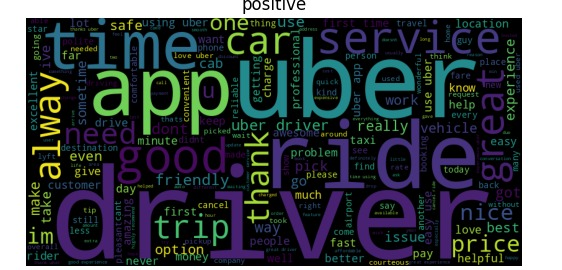
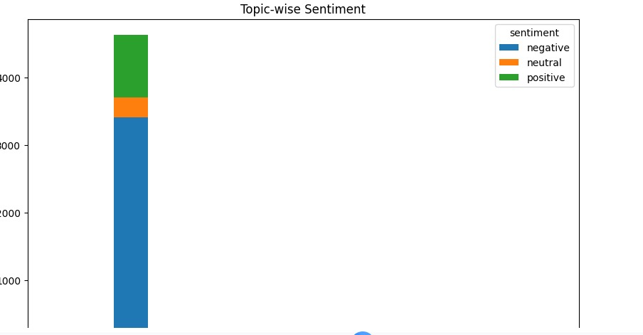
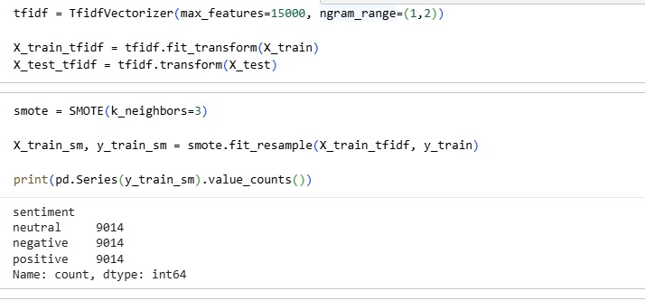
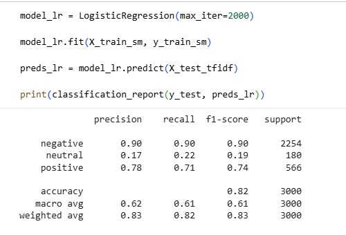
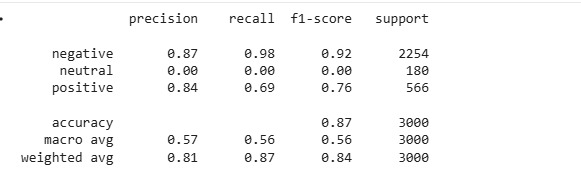

 # 🚀 Uber Sentiment & Topic Analyzer  

An end-to-end NLP system that analyzes Uber user reviews to extract sentiment, identify key topics, and generate actionable insights using Machine Learning and Deep Learning.

---

## 🔥 Overview  

This project converts raw Uber reviews into meaningful insights using:

- Sentiment Analysis (Negative / Neutral / Positive)  
- Topic Modeling (what users are talking about)  
- Machine Learning + Deep Learning models  

The goal is not just prediction — but *understanding customer experience at scale*.

---

## 📸 Output Preview  

### 🔹 Model Outputs  

  
  
  
  

---

## 🎥 Project Demo  

[](u…
[00:18, 18/03/2026] Mallika Bhardwaj: # Uber Sentiment & Topic Analyzer

---

## Project Overview

This project analyzes Uber reviews using *classical ML models* and *deep learning NLP*.  
It performs:

- *Sentiment Analysis:* Negative / Neutral / Positive  
- *Topic-wise Classification:* Detecting recurring themes in reviews  
- *Visualization:* WordClouds for frequent terms  
- *Deployment-ready workflows:* Google Colab & Jupyter compatible  

The workflow combines *fast ML baselines* (Logistic Regression, KNN) with *context-aware deep learning* (DistilBERT) for a complete end-to-end solution.

---

## Demo Video

<video controls width="720">
  <source src="uber vid.mp4" type="video/mp4">
  Your browser does not support the video tag. Download the video [here](uber vid.mp4).
</video>

---

## Screenshots & Static Visuals

Here are key outputs from the project:

  
  
  
  
  
  
  

These illustrate:  
- Frequent term WordClouds  
- Topic-wise review clustering  
- ML and NLP model predictions  

---

## Features

- *ML Models:* Logistic Regression, KNN  
- *Deep Learning NLP:* DistilBERT for contextual understanding  
- *WordClouds:* Identify most frequent words visually  
- *Class Imbalance Handling:* Class weights improve neutral predictions  
- *Topic-wise Classification:* Reveals hidden feedback patterns  
- *Deployment Ready:* Can run in Colab or Jupyter  

---

## Results

- *Overall Accuracy:* ~88%  
- *Neutral Class Performance:* Significantly improved with class weights  
- *ML Baselines:* Fast and interpretable results  
- *Deep Learning:* Contextual sentiment detection for complex text  

---

## How to Run

1. Open UberSentimentProject.ipynb in Colab or Jupyter Notebook  
2. Install dependencies
