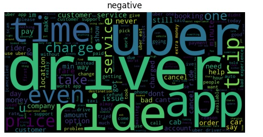

# Uber Sentiment & Topic Analyzer

---

## Project Overview

This project analyzes Uber reviews using *classical ML models* and *deep learning NLP*.  
It performs:

- *Sentiment Analysis:* Negative / Neutral / Positive  
- *Topic-wise Classification:* Detecting recurring themes in reviews  
- *Visualization:* WordClouds for frequent terms  
- *Deployment-ready workflows:* Google Colab & Jupyter compatible  

The workflow combines *fast ML baselines* (Logistic Regression, KNN) with *context-aware deep learning* (DistilBERT) for a complete end-to-end solution.

## Screenshots & Static Visuals

Here are key outputs from the project:

  
  
  

  
  
  

 ## Demo Video

Click below to watch the full demo:

These illustrate:  
- Frequent term WordClouds  
- Topic-wise review clustering  
- ML and NLP model predictions  

---

## Features

- *ML Models:* Logistic Regression, KNN  
- *Deep Learning NLP:* DistilBERT for contextual understanding  
- *WordClouds:* Identify most frequent words visually  
- *Class Imbalance Handling:* Class weights improve neutral predictions  
- *Topic-wise Classification:* Reveals hidden feedback patterns  
- *Deployment Ready:* Can run in Colab or Jupyter  

---

## Results

- *Overall Accuracy:* ~88%  
- *Neutral Class Performance:* Significantly improved with class weights  
- *ML Baselines:* Fast and interpretable results  
- *Deep Learning:* Contextual sentiment detection for complex text  

---

## How to Run

1. Open UberSentimentProject.ipynb in Colab or Jupyter Notebook  
2. Install dependencies:
pip install pandas numpy matplotlib seaborn scikit-learn torch transformers wordcloud
3. Run notebook sequentially:
   - Data Loading → Sentiment Labeling → TF-IDF → ML → NLP → WordCloud → Topic Classification  
4. Output images (uber 1 → uber 7) and video (uber vid) display inline  

---

## Key Takeaways

- Classical ML (Logistic Regression, KNN) provide *fast and strong baselines*  
- DistilBERT captures *contextual sentiment* effectively  
- Topic-wise classification uncovers *hidden insights* in reviews  
- Neutral class predictions are *enhanced using class weights*  
- Workflow is *reproducible, visually appealing, and portfolio-ready*  

---

> This project demonstrates an *end-to-end ML + NLP solution*, ready for deployment and portfolio presentation.
